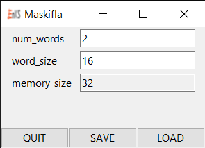
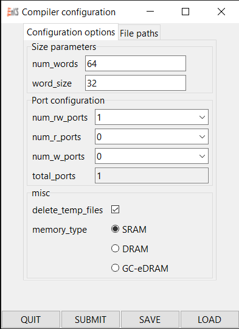

maskifla 
-

Maskifla is a python library to facilitate getting user input for a list of parameters through a simple tk gui. The name maskifla comes from the talmudic phrase מתקיף לה, meaning to ask a question.

Maskifla is setup by a parent program which passes a list of properties to gather input for, along with other informtion, such as the input types, default values, and callback functions for input validation.

The user can then enter input, save or load the values from a file, or if a callback function has been setup, pass all the values back to the parent program.

# Usage

## Import

As of now maskifla is just one python file with a single class, and can be imported like this:

```
from maskifla import Form
```

## Constructor

To use maskifla, you must first initilize a new Form object and than display it.

The constructor has the following form:

```
Form(properties,defaults={},callback=None,submit=None,title="Maskifla",icon=None,forceValidate=True)
```

- `properties` is a list of property dictionaries, one for each input, with the following keys (most of which are optional):
    - `name` is the name of the property. This gets displayed on the form and is used as a key to reference it. 
    - `type` is the input type, available options are `textbox` (default), `outputbox`, `checkbox`, `dropdown`, `radio`.
        - `textbox` takes freeform text input (this is the default).
        - `outputbox` is like `textbox`, but doesn't allow user input, and never triggers the callback. Used for displaying an immediate output during form entry.
        - `checkbox` is shown to the user as a checkbox. Its internal values are "0" and "1".
        - `dropdown` shows a list of `options` in a dropdown menu that the user can select from.
        - `radio` is like `dropdown` but uses radio buttons.
    - `options` is the list of options for `dropdown` and `radio`. Ignored by other types.
    - `default` is the value the input starts with. Defaults to "".
    - `category` is the tab to place the input in. Defaults to "misc" if other tabs exist, and no tabs are shown if not.
    - `subcategory` is the group within the tab to place the input. Same default behaviour as `category`.
    - `description` is the string to be displayed on the bottom of the form when the input is mouseovered.
- `defaults` is a dictionary of name/value pairs to override the default values given in `properties.`
- `callback` is function that runs everytime input is modified or focus is shifted from an input.
- `submit` is a function that runs when the form is submitted. If no function is specified then no SUBMIT button will be shown.
- `title` is what goes in the form's titlebar
- `icon` is a string of a path to an ico file to be used in the titlebar
- `forceValidate` is a flag that will cause the SUBMIT and SAVE buttons to be disabled whenever an error messege is displayed.

The `callback` function has the following form:

```
callback(name,value,trigger)
```

- `name` is the name of the property most recently edited.
- `value` is its (new) current value, as a string.
- `trigger` is the reason the callback was called you can add a quick "if trigger==X:return" to ignore some of these.
    - "`default`" means that value was initilized.
    - `"trace"` means the input was modified by user. 
    - `"focusout"` means that focus was shifted to a different input.

The `submit` fuction looks like this:

```
submit(values)
```

-  `values` is a dicitonary of all the name,value pairs. This is the same format that gets exported to a file with the `SAVE` button.

## Methods

The following methods are available on a maskifla Form object. Note that all returned values are strings:

- `displayForm()` displays the form to the user. Must be run before any of the other methods.
- `getvalues()` gets a dictionary of all the name,value pairs, similar to the export format and the `submit` callback.
- `getvalue(parameter)` gets a single value.
    - `parameter` is the name of the value.
- `setvalues(dict)` sets all of the values.
    - `dict` is a dictionary of all the name,value in the same format as getvalue().
- `setvalue(parameter,value)` sets a single value.
    - `parameter` is the name of the value to set.
    - `value` is the new value.
- `printError(errstring)` prints an error message to the bottom of the form in red. If `forceValidate` is True (default), then the `SUBMIT` and `SAVE` buttons will be greyed out.
    - `errstring` is the error message to display.
- `clrError()` clears the current error message and renables the `SUBMIT` and `SAVE` buttons.

# Example:


```
from maskifla import Form

properties = [
{	"name":"num_words",								
	"type":"textbox",								
	"default":"2",									
	"description": "Number of words",				},	
{	"name":"word_size",
	"type":"textbox",
	"default":"16",
	"description": "Size of word, must be even",	},
{	"name":"memory_size",
	"type":"outputbox",
	"default":"32",
	"description": "Calculated total memory size",	}
]

def callback(name,value,trigger):
	try:
		if int(f.getvalue("word_size"))%2:
			f.printError("ERROR: word_size must be even. Please fix.")
		else:
			f.printError("")
		f.setvalue("memory_size",int(f.getvalue("num_words"))*int(f.getvalue("word_size")))
	except: #things that will throw errors when casting to int
		f.printError("ERROR: invalid input")

f = Form(properties=properties, callback=callback, title="Size parameters", icon="logo.ico")
f.displayForm()
```

This results in the following form:



The gap under the inputs is where the description mouseover and error message get displayed. 

A longer example utilizing all input types can be found [here](/example/test.py) and results in the following form:


